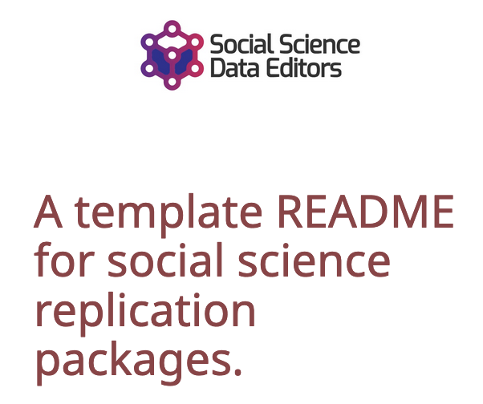
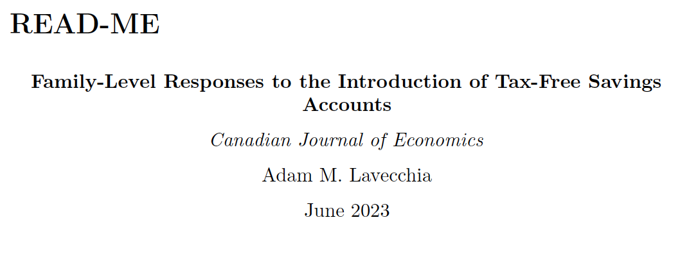
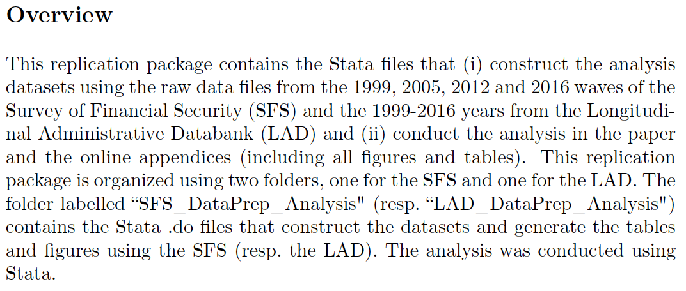
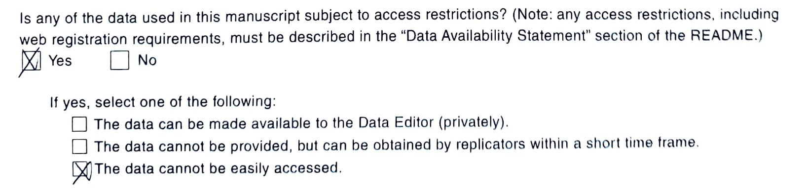
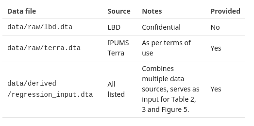

# Elements of a README

## Overview {.smaller}

::: {.columns}

:::: {.column width=45%}

- **The role of the template README**

::::
  
:::: {.column width=55%}

- Entry point to understand contents of package
- Especially crucial when data are *confidential* and thus not provided with the replication package
- There are requirements and good practices, but your ReadMe will reflect your package—it’s not a “one size fits all” document


::::
  
:::

## Best practices {.smaller}

::: {.columns}

::::  {.column width=45%}

- The role of the template README
- **Best practices**
::::
  
:::: {.column width=55%}

- Start writing your ReadMe from **DAY 1** 
  - It will take a minute to add some notes today, but probably hours to retrieve all the information years from now
  - Pay special attention to your *rights*: what are the terms of use of your data, what is the license? Save that information


::::
  
:::


# Template README

## V1.1 Published in November 2022 {.smaller}

::: {.columns}

::::  {.column}

> Lars Vilhuber, Connolly, M., Koren, M., Llull, J., & Morrow, P. (2022). A template README for social science replication packages (v1.1). Social Science Data Editors. https://doi.org/10.5281/zenodo.7293838 

::::

:::: {.column}



::::

:::

## Using the Template README

You can download the Word, LaTeX, or Markdown version of the README with lots of examples.

```{=html}
<iframe width="780" height="500" src="https://social-science-data-editors.github.io/template_README/" title="README landing page"></iframe>
```

## Online Generator

You can also try Miklós Koren's online generator <https://www.templatereadme.org/>.


```{=html}
<iframe width="780" height="500" src="https://www.templatereadme.org/" title="README generator"></iframe>
```

# An Example

> Lavecchia, Adam, 2023, “Replication Data and Code for: Family-Level Responses to the Introduction of Tax-Free Savings Accounts”, https://doi.org/10.5683/SP3/M6HLUF, Borealis, V1.





## Overview

```{=html}

<iframe width="780" height="500" src="https://social-science-data-editors.github.io/template_README/#description" title=""></iframe>

```

## Overview

> INSTRUCTIONS: The typical README in social science journals serves the purpose of guiding a reader through the available material and a route to replicating the results in the research paper. Start by providing a *brief overview* of the available material and a brief guide as to how to proceed from beginning to end

## Overview

**guides a reader through the available material and a route to replicating the results in the research paper**, including 

- the description of the origins of data and/or description of programs. 
- provides a brief overview of the available material and 
- provides a brief guide as to how to proceed from beginning to end
- then dives into the specifics.

## Overview



## Data and Code Availability Statement (DCAS)

```{=html}

<iframe width="780" height="500" src="https://social-science-data-editors.github.io/template_README/#data-and-code-availability-statement" title=""></iframe>

```


## Data and Code Availability Statement (DCAS) {.build}

It contains information about the **sources of data used in the replication package**, in addition to or instead of such detailed description in the manuscript. 

- Not just a data citation
- describes additional information necessary for the obtention of the data. 

These may include 

- required registrations, 
- memberships, 
- application procedures, 
- monetary cost, or 
- other qualifications.


## Computational Requirements

```{=html}

<iframe width="780" height="500" src="https://social-science-data-editors.github.io/template_README/#computational-requirements" title=""></iframe>

```


## Computational Requirements {.build}

For simple replication packages, may appear to be trivial (a laptop and some common software)

What if requirement is **expensive commercial software** and **a super computer cluster**?


## Computational Requirements

In order to assess the complexity of the task of replicating, authors should specify each of the following elements:

-  **Software** used, including version number as used. If the code is expected to run with a lower version number, that should be added.
- Any additional **packages**, including their version number or similar, as used.
-   The **computer hardware specification** as used by the author, in terms of OS, CPU generation and quantity, memory and necessary disk space. If multiple computers were used, the specification for each should be identified.
-  The **wall-clock time** given the provided computer hardware, expressed in appropriate units (minutes, days).

# Details of the README

## Expectations

The README is strongly suggested, but sometimes ignored. 

You should nevertheless treat all replication packages as if they should have had the same information, easily accessible.

## More details {.smaller}


```{=html}

<iframe width="780" height="500" src="https://social-science-data-editors.github.io/template_README/template-README.html#data-availability-and-provenance-statements" title=""></iframe>

```
## More details {.flexbox .vcenter}

Important: **The information should describe ALL data used, regardless of whether they are provided as part of the replication archive or not, and regardless of size or scope.**

For instance, if using GDP deflators, the source of the deflators (e.g. at the national statistical office) should also be listed here.

## Rights and licenses


```{=html}

<iframe width="780" height="500" src="https://social-science-data-editors.github.io/template_README/template-README.html#statement-about-rights" title=""></iframe>
```

## Rights and licenses

- We attempt to check if we can OBTAIN data when authors say we cannot
- We attempt to check if authors are ALLOWED to provide the data when the data are included
- We may obtain data as per instructions by the authors
  - At its simplest, we check that the URL works, and that the landing page provides enough information to obtain the data
  
## Availability of data


```{=html}

<iframe width="780" height="500" src="https://social-science-data-editors.github.io/template_README/template-README.html#summary-of-availability" title=""></iframe>
```

## Availability of data

For the AEA submissions, this information is also available (somewhat different) as part of the "Data and Code Availability Form" (DCAF):



## Listing of data sets

Data sources translate into datasets. Ideally, the README lists them:



## Computational requirements

To some extent, the crux of the matter: what do you need to run the analysis?

- Computers
- Software
- Time

## Computational requirements


```{=html}

<iframe width="780" height="500" src="https://social-science-data-editors.github.io/template_README/template-README.html#computational-requirements" title=""></iframe>

```

## Computational requirements and your job {.build}

You will need to figure out if you can do it (we'll get to that part).

- You do not need to run on your laptop
- You should not run on your laptop if it will take too long!

> Portions of the code were last run on a 12-node AWS R3 cluster, consuming 20,000 core-hours.

## The code


```{=html}

<iframe width="780" height="500" src="https://social-science-data-editors.github.io/template_README/template-README.html#description-of-programscode" title=""></iframe>

```

## The code

This should provide some details, but ideally:

- explain summarily what the code does
- might explain in detail what the code does

## Instructions


```{=html}

<iframe width="780" height="500" src="https://social-science-data-editors.github.io/template_README/template-README.html#instructions-to-replicators" title=""></iframe>
```
