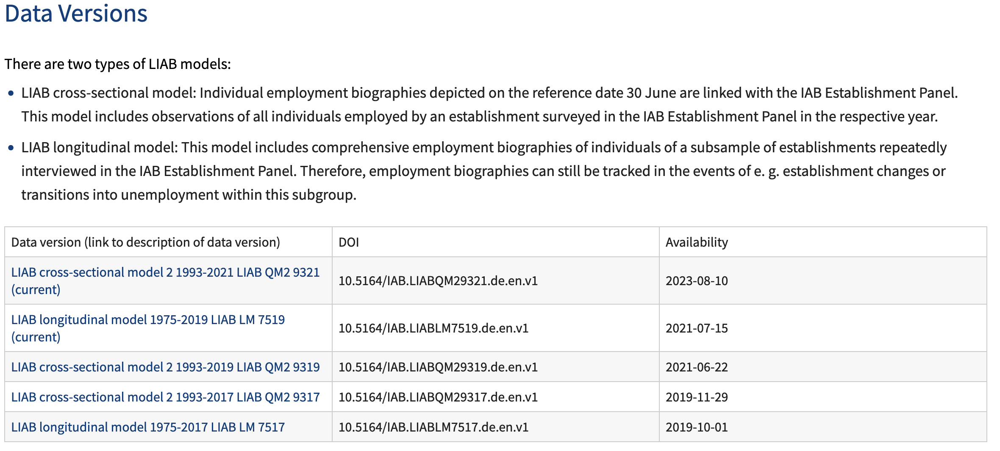
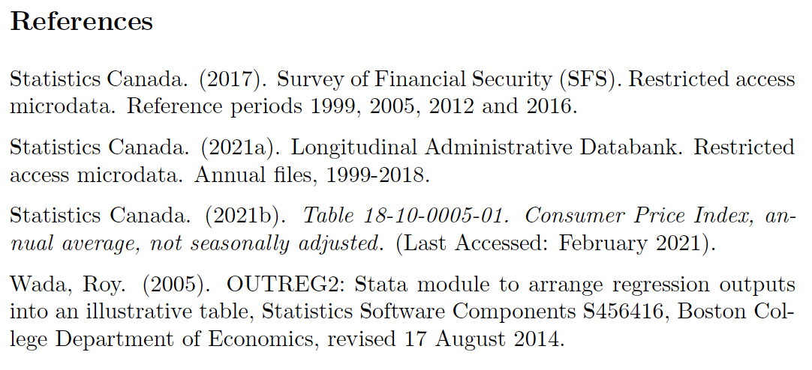

# Elements of a README

## Overview {.smaller}

::: {.columns}

:::: {.column width=45%}

- **The role of the template README**

::::
  
:::: {.column width=55%}

- Entry point to understand contents of package
- Especially crucial when data are *confidential* and thus not provided with the replication package
- There are requirements and good practices, but your ReadMe will reflect your package—it’s not a “one size fits all” document


::::
  
:::

## Best practices {.smaller}

::: {.columns}

::::  {.column width=45%}

- The role of the template README
- **Best practices**
::::
  
:::: {.column width=55%}

- Start writing your ReadMe from **DAY 1** 
  - It will take a minute to add some notes today, but probably hours to retrieve all the information years from now
  - Pay special attention to your *rights*: what are the terms of use of your data, what is the license? Save that information


::::
  
:::


# Template README

## V1.1 Published in November 2022 {.smaller}

::: {.columns}

::::  {.column}

> Lars Vilhuber, Connolly, M., Koren, M., Llull, J., & Morrow, P. (2022). A template README for social science replication packages (v1.1). Social Science Data Editors. https://doi.org/10.5281/zenodo.7293838 

::::

:::: {.column}


::::

:::

## Using the Template README

::: {.columns}

::::  {.column}

You can download the Word, LaTeX, or Markdown version of the README with lots of examples.
::::

:::: {.column}

```{=html}
<iframe width="780" height="500" src="https://social-science-data-editors.github.io/template_README/" title="README landing page"></iframe>

```
::::

:::

## Online Generator

::: {.columns}

:::: {.column}

You can also try Miklós Koren's online generator <https://www.templatereadme.org/>.

::::

:::: {.column}

```{=html}
<iframe width="780" height="500" src="https://www.templatereadme.org/" title="README generator"></iframe>
```

::::

:::

## An Example

> Lavecchia, Adam, 2023, “Replication Data and Code for: Family-Level Responses to the Introduction of Tax-Free Savings Accounts”, https://doi.org/10.5683/SP3/M6HLUF, Borealis, V1.

::::

:::: {.column}


::::

:::

# Overview

[](https://social-science-data-editors.github.io/template_README/#description)

## Overview

> INSTRUCTIONS: The typical README in social science journals serves the purpose of guiding a reader through the available material and a route to replicating the results in the research paper. Start by providing a *brief overview* of the available material and a brief guide as to how to proceed from beginning to end

## Overview {.smaller}

**guides a reader through the available material and a route to replicating the results in the research paper**, including 

- the description of the origins of data and/or description of programs. 
- provides a brief overview of the available material and 
- provides a brief guide as to how to proceed from beginning to end
- then dives into the specifics.

## Overview (Example) {.smaller}


# Data and Code Availability Statement (DCAS)

[](https://social-science-data-editors.github.io/template_README/#data-and-code-availability-statement)

## Data and Code Availability Statement (DCAS) {.smaller}

It contains information about the **sources of data used in the replication package**, in addition to or instead of such detailed description in the manuscript. 

- If information is provided as part of an appendix in the paper **with the same level of detail described here**, then the README can refer to that appendix.


## Data and Code Availability Statement (DCAS) {.smaller}

The information should describe **ALL** data used, regardless of whether they are provided as part of the replication archive or not, and regardless of size or scope!

- Should describe the conditions under which (a) the **current authors** (b) *any future users* might access the data (which may differ)


## Data and Code Availability Statement (DCAS) {.smaller}

These may include 

- required registrations, 
- memberships, 
- application procedures, 
- monetary cost, or 
- other qualifications.

## Data and Code Availability Statement (when primary) {.smaller}

When the data were generated (by the authors) in the course of conducting (lab or field) **experiments**, or were collected as part of **surveys** run by the authors, then the description of the provenance should describe the data generating process, i.e., *survey or experimental procedures*


## Caution about inclusion or exclusion of data

- Authors sometimes believe that because the data were "publicly available" they could include them in the replication package. This is **not always true**

> If providing the data as part of the replication package, authors should be clear about whether they have the rights to distribute the data

## Rights to use data, and rights to distribute data


## Rights to use data, and rights to distribute data

Example: if data are on a restricted server, and you have access:

- You have the rights to use the data
- You do NOT have the rights to distribute the data

## Rights to use data, and rights to distribute data

Less obvious: You were able to download the data from a website that did not require a login.[^wvs]

- You have the rights to use the data
- You *may* have the rights to distribute the data, depending on **terms of use** or **license**, and whether you had to agree to those terms of use.

[^wvs]: [World Values Survey](https://www.worldvaluessurvey.org/wvs.jsp) data are available for download without a login, but you have to agree to terms of use that prohibit redistribution.


## Data and Code Availability Statement (Example: restricted) 


## Data and Code Availability Statement (Example: public) 


## Listing of data sets

Data sources translate into datasets. Ideally, the README lists them:


## Listing of data sets: Example {.smaller}


# Computational Requirements


## Computational Requirements

[](https://social-science-data-editors.github.io/template_README/#computational-requirements)


## Computational Requirements {.smaller}

For simple replication packages, may appear to be trivial (a laptop and some common software)

What if requirement is **expensive commercial software** and **a super computer cluster**?


## Computational Requirements {.smaller}

In order to assess the complexity of the task of replicating, authors should specify each of the following elements:

-  **Software** used, including version number as used. If the code is expected to run with a lower version number, that should be added.
- Any additional **packages**, including their version number or similar, as used.
-   The **computer hardware specification** as used by the author, in terms of OS, CPU generation and quantity, memory and necessary disk space. If multiple computers were used, the specification for each should be identified.
-  The **wall-clock time** given the provided computer hardware, expressed in appropriate units (minutes, days).

## Software {.smaller}

> INSTRUCTIONS: List all the software requirements, up to and including any operating system requirements, for the entire set of code

- List each package, and the **version** you used, including dependencies
- Suggested: distribute most dependencies together with the replication package if allowed, in particular if sourced from unversioned code repositories, Github repos, and personal webpages.
- Suggested: if possible, pre-install [link](https://larsvilhuber.github.io/self-checking-reproducibility)
- Suggested: use environments (Python, R, Julia, also Stata)

## Software: Example {.smaller}


## PseudoRNG seed {.smaller}


## PseudoRNG seed {.smaller}

> INSTRUCTIONS: Some estimation code uses random numbers, almost always provided by pseudorandom number generators (PRNGs). For reproducibility purposes, these should be provided with a deterministic seed, so that the sequence of numbers provided is the same for the original author and any replicators

:::: {.columns}

::: {.column width=45%}


[^randon]

[^randon]: Image by JoePhin, under Creative Commons Attribution-Share Alike 4.0 International license. <https://commons.wikimedia.org/wiki/File:Numbers.gif>

:::

::: {.column width=50%}

[](https://xkcd.com/221/)

:::

::::

## What is a computer?

> INSTRUCTIONS: Give information on the machine you used, especially if specialized hardware is needed (e.g. high-power servers)

## What is a computer? Example


# The code


[](https://social-science-data-editors.github.io/template_README/template-README.html#description-of-programscode)


## The code

This should provide some details, but ideally:

- explain summarily what the code does
- do so for ALL code, even when data are not included in replication package

> Important: Remove any redundant code.

## The code: Example


## Instructions


[](https://social-science-data-editors.github.io/template_README/template-README.html#instructions-to-replicators)


## Instructions

- Provide **human-readable** instructions to conduct the replication
- May be simple or may involve many complicated steps. 
- List format, no excess prose (or poems, except Haiku). Strict **linear** sequence. 
- If more than 4-5 manual steps, please wrap a **main program**/Makefile around them, in logical sequences

## Instructions: Example


## List of tables and programs


## List of tables and programs

> INSTRUCTIONS: Your programs should **clearly** identify the tables and figures as they appear in the manuscript, by number

- If using named programs (`table1.do`) this may not be necessary, but should be stated.
- If mnemonics are used (`table_ols_rds_55.do`), a mapping is necessary. 
- If not produced by code (e.g. sourced elsewhere), a mention is useful

## List of tables and programs: Example


# References

## References

> INSTRUCTIONS: As in any scientific manuscript, you should have proper *references*. Cite your data, the packages that you use, everything you refer to in the ReadMe, and generally everything you rely upon

- References should also be included in manuscript (subject to journal style considerations)
- Guidance for citations: <https://social-science-data-editors.github.io/guidance/addtl-data-citation-guidance.html>

## References: Admin data

- Some admin data are very well referenced, others less so…
- Ideally, each data set comes with its own DOI and clear reference
- If not, try to provide as much information as you can, especially what needs to be requested for someone to reproduce what you did

## References: Admin data - Example

> Good example 1, German data: <https://fdz.iab.de/en/our-data-products/integrated-establishment-and-individual-data/liab/>




## References: Admin data - Example

Good example 2, French data: <https://www.casd.eu/en/source/all-employees-databases-establishment-data/> 

:::: {.columns}

::: {.column width=45%}


:::

::: {.column width=45%}


:::

::::

## References: Example




# Summary {.smaller}

- The ReadMe is a central part of a data and code replication package
- It's the instructions manual to your package
- Whether or not you can provide the data is almost irrelevant
- You still need to explain their availability and provenance
- The earlier you start collecting the information necessary for the ReadMe, the easier the task becomes
- There are [resources](index.html#/resources)  available to help you  
